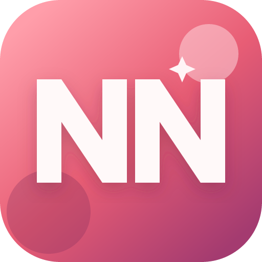
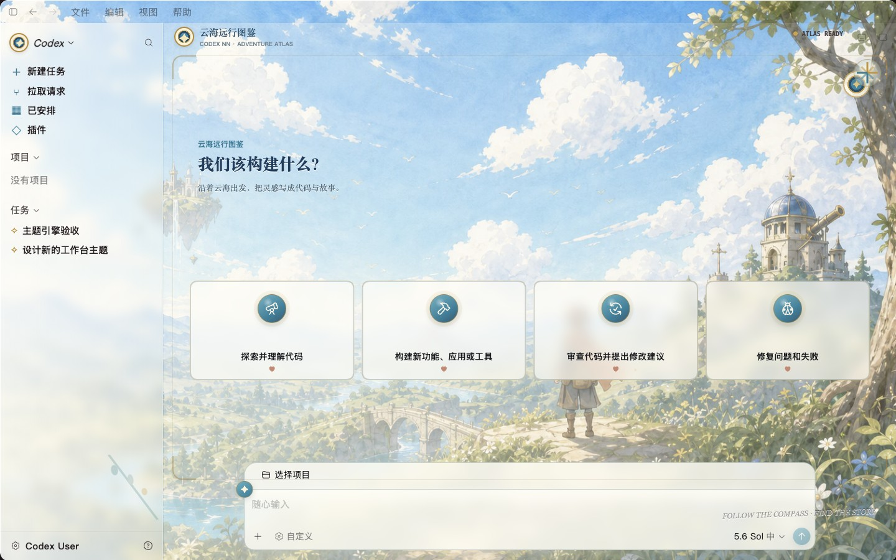
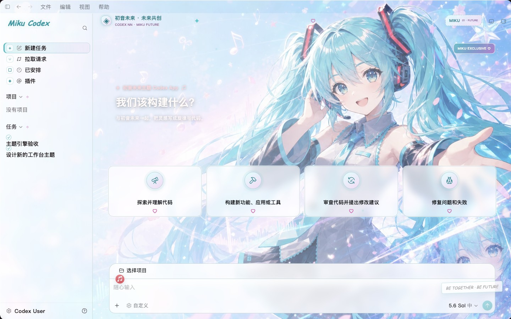
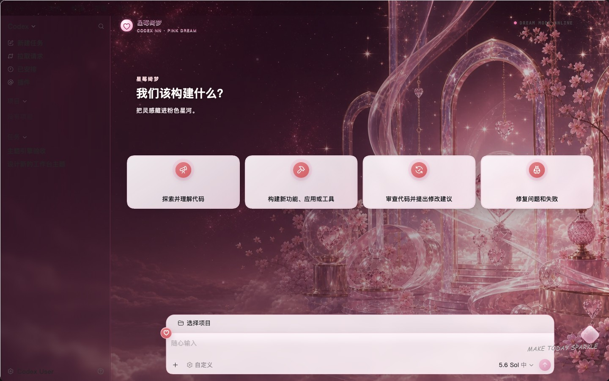
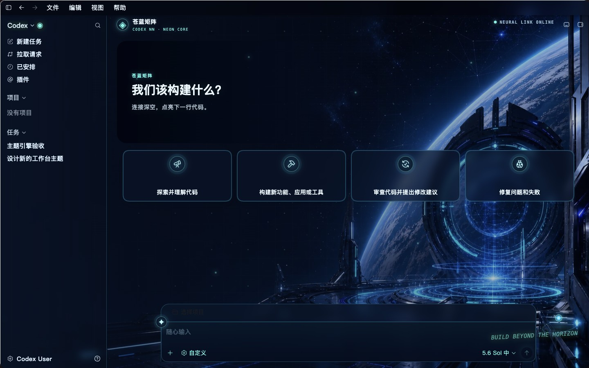
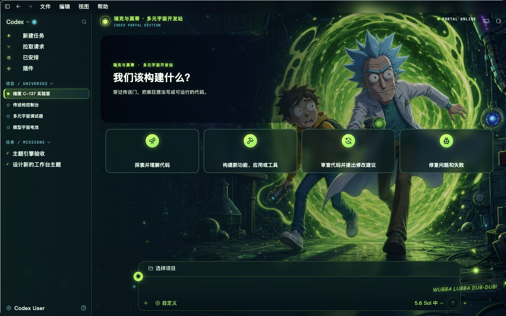
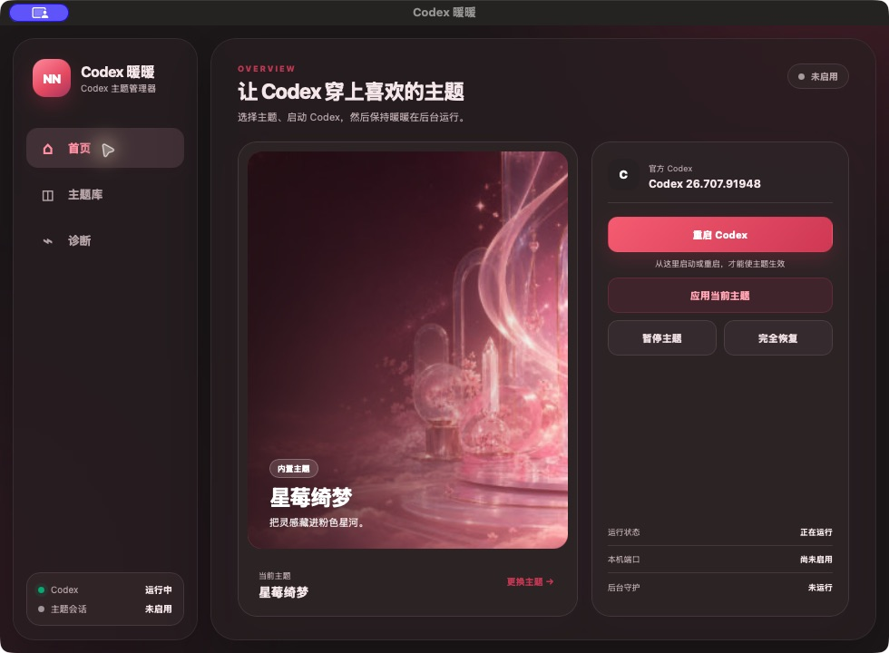
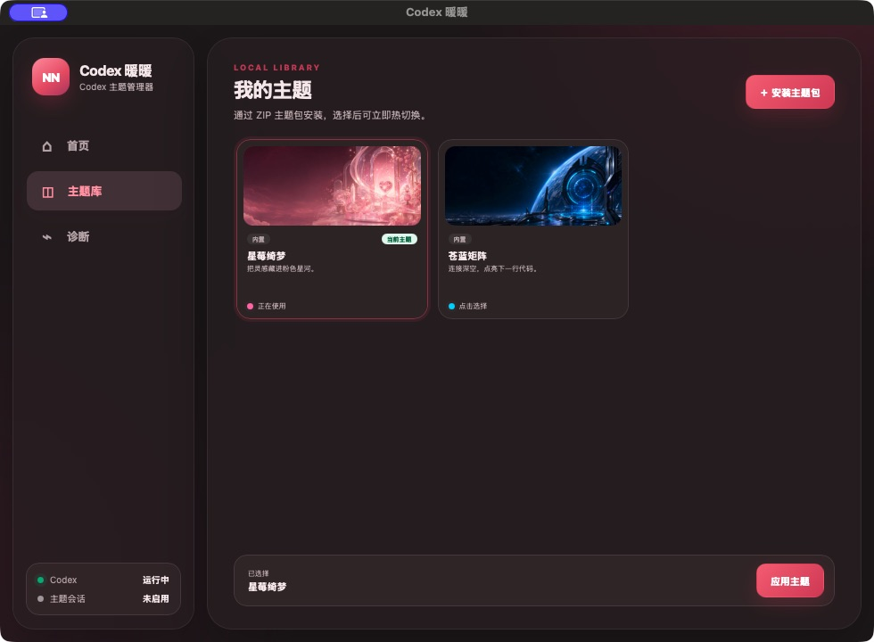
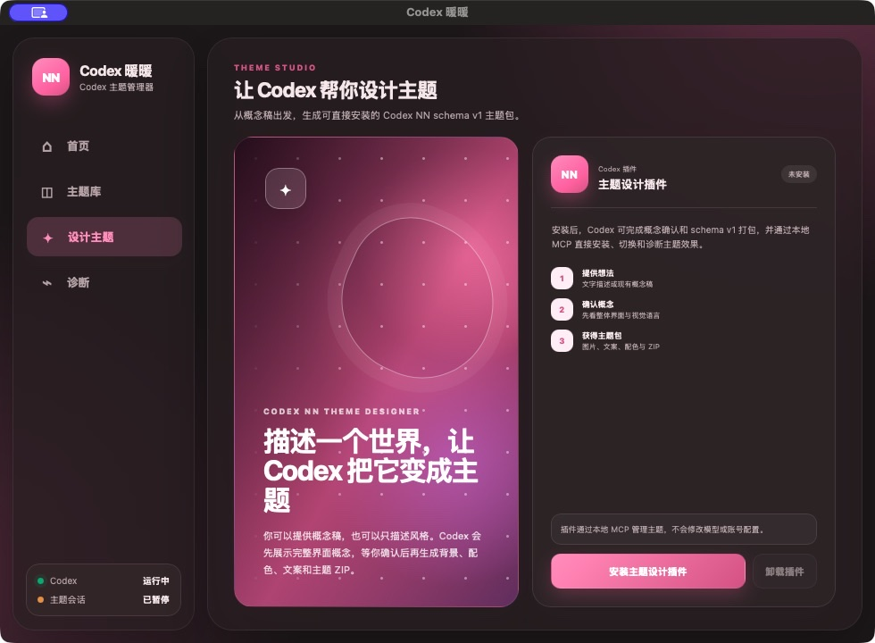

<p align="center">
  <a href="./README.md">简体中文</a> · English
</p>

<p align="center">
  
</p>

<h1 align="center">Codex NN</h1>

<p align="center">
  <strong>Give Codex a fresh new look.</strong>
</p>

<p align="center">
  Visual theming · AI theme design · Easy setup · Instant switching
</p>

<p align="center">
  
  
  
  
</p>

> [!IMPORTANT]
> Codex NN is a community project, not an official OpenAI product. It does not modify the official Codex installer, application files, or code signature.

## About

**Codex NN** is a visual theme manager for the official Codex Desktop app.

Compatible with [Codex Dream Skin](https://github.com/Fei-Away/Codex-Dream-Skin) theme packages, so existing themes can be imported and used directly.

No manual file editing or repeated scripts are required. Open Codex NN, choose a theme, and launch or switch with one click to give Codex a completely new appearance.

## Built-in Theme Preview

Every screenshot below shows the full Codex new-task page.

### Adventure Atlas



### Miku Future Collab



### Strawberry Starlight



### Azure Neon Frontier



### Rick and Morty Multiverse Lab



## Interface Preview

### Home



### Theme Library



### Theme Designer



## Highlights

- **Visual workflow**: preview, install, switch, and restore themes from a desktop interface
- **No-code theme design**: describe a visual style or provide a concept image; no knowledge of color systems, schemas, or packaging is required
- **Built-in theme design Skill**: install the bundled designer plugin for Codex or Claude Code and let the AI create the concept, background, palette, copy, and theme package
- **Design with live feedback**: Codex or Claude Code installs, switches, and diagnoses themes through the local MCP so you can review the real interface and keep refining it in the same conversation
- **Ready to use**: includes Adventure Atlas, Miku Future Collab, Strawberry Starlight, Azure Neon Frontier, and Rick and Morty Multiverse Lab
- **Instant switching**: hot-swap themes while a managed theme session is running
- **Local theme library**: install, update, and manage your own ZIP theme packages
- **Full control**: launch or restart Codex, pause theming, or restore the official appearance
- **Diagnostics**: inspect the Codex installation, theme files, local port, and live result
- **Background companion**: stays in the system tray to maintain the active theme
- **Automatic updates**: checks GitHub Releases at startup and installs updates in the app
- **Cross-platform**: supports macOS and Windows

## Quick Start

### Install and Run

1. Install and launch the official Codex Desktop app at least once.
2. Download the installer for your system from [Releases](../../releases).
3. Install and open Codex NN.
4. Choose a theme in the theme library and select **Apply Theme**.
5. Launch or restart Codex from Codex NN for the theme to take effect.

> [!TIP]
> Keep Codex NN running in the background while a theme session is active. Closing the main window sends it to the system tray; quitting from the tray pauses the active theme automatically.

### Platform Support

| Platform | Supported Codex distribution | Installer |
| --- | --- | --- |
| macOS | Official Codex Desktop app | Universal `.dmg` / `.app` |
| Windows | Official Codex from Microsoft Store | x64 `.exe` |

Linux is not currently supported.

## Using Themes

In the theme library, select **Install Theme Package** and choose a ZIP file that follows the Codex NN theme format. Installed themes can be previewed, switched, updated, or removed.

A minimal theme package contains two files:

```text
my-theme.zip
├── theme.json
└── background.webp
```

Theme packages contain only a manifest and a local image. Scripts, CSS, remote resources, and encrypted files are not supported. See the [Theme Package v1 specification](./docs/theme-package-v1.md) for all fields, image requirements, and packaging instructions.

To migrate a Dream Skin macOS theme, select **Import Dream Skin** and choose either its theme directory or a two-file ZIP. Codex NN preserves schema v1 field semantics and renders it with the synchronized Dream Skin 1.2.0 engine without executing scripts or CSS from the theme package.

## Designing Themes with Codex

You do not need to learn the theme format or edit configuration files:

1. Open **Design Theme** in Codex NN and select **Install Theme Designer Plugin**.
2. Start a new task in Codex. Describe the visual style in a sentence or attach a concept image.
3. Codex first creates a complete interface concept for your approval. After approval, it produces the background, palette, copy, and a validated schema v1 ZIP.
4. Codex installs and switches the theme through the local MCP. Review it in the real Codex interface, request adjustments in the same conversation, and collect the final ZIP when it is ready.

The theme designer plugin can be removed at any time from the **Design Theme** page.

## Designing Themes with Claude Code

The Claude Code plugin uses the same Codex NN schema v1 specification and local MCP. Codex NN only installs the theme design Skill and MCP connection; it does not manage your Claude Code account or model configuration:

1. Install Claude Code using the [official setup guide](https://code.claude.com/docs/en/setup), complete your own login, model, and endpoint setup, then run `claude --version` to verify that the command is available.
2. Select Claude Code on the **Design Theme** page in Codex NN, then select **Install Claude Code Plugin**.
3. Keep Codex NN running and start a new Claude Code session. Describe the theme or attach a concept image. Claude first presents a complete interface concept; only after your explicit approval does it create the final background and ZIP, then install, switch, and diagnose the theme through MCP.

The Skill is installed at `~/.claude/skills/codex-nn-theme-designer`. Claude Code continues to use your existing login state, model, and endpoint settings. Codex NN does not read or modify `~/.claude/settings.json`, and it never reads, stores, or transmits your Claude Code API key.

## How It Works

Codex NN connects to a locally running Codex page through the Chrome DevTools Protocol (CDP), listening only on `127.0.0.1`. It applies the selected theme and keeps the theme state active in the background.

- Does not modify the official Codex installation directory
- Does not replace official binaries
- Does not invalidate the application code signature
- Connects only to validated loopback ports owned by the current Codex process
- Can restore the official launch behavior and appearance at any time

## Security

During a managed theme session, Codex exposes a debugging port restricted to the local machine. Codex NN validates port ownership and rejects non-loopback connections, but you should still avoid running untrusted local software during a theme session.

Codex updates may change the interface and temporarily affect theme compatibility. If that happens, run Diagnostics or use **Restore Completely** to return to the official appearance.

## Contributing

Issues and pull requests are welcome, including bug reports, compatibility feedback, and improvements to Codex NN.

## License

Codex NN is open source under the [MIT License](./LICENSE).

## Credits and Disclaimer

Parts of the theme engine are adapted from Codex Dream Skin Studio. See [Third-Party Notices](./THIRD_PARTY_NOTICES.md) and the [corresponding license text](./THIRD_PARTY_LICENSE_CODEX_DREAM_SKIN.txt).

Codex, OpenAI, Claude, Anthropic, and related names and marks belong to their respective owners. This project is not affiliated with or endorsed by OpenAI or Anthropic.

---

<p align="center">
  If Codex NN makes your workspace more delightful, consider leaving a Star ⭐
</p>
